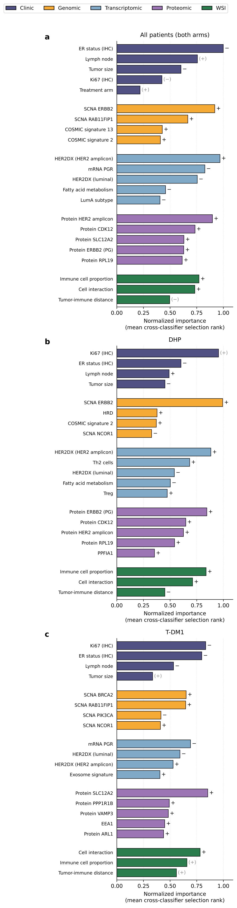

# Results

Every table on this page is generated directly from the deposited workbooks under [`report/tables/`](report/tables) by [`docs/build_RESULTS_md.py`](docs/build_RESULTS_md.py), and every figure is the PNG rendering of the corresponding PDF in [`report/figures/`](report/figures). Nothing here is typed by hand.

Pipeline `2.0.0-revision1`, seed 42. Regenerated 2026-09-06.

> **How to read every number below.** In each cross-validation repeat every patient has exactly one out-of-fold prediction; the metric is computed on that complete out-of-fold vector and averaged over the repeats (200 pooled, 100 per arm). The 95% interval is a patient-level **cluster** bootstrap — 2,000 stratified resamples of patients, a resampled patient carrying all of its repeat predictions. Predictions are never averaged across repeats or across models. A comparison whose interval for ΔAUROC includes zero is reported as *not distinguishable*, however large the point difference.

## Contents

1. [Design and cohort](#1-design-and-cohort)
2. [Cross-validated performance](#2-cross-validated-performance)
3. [Integration versus the best single modality](#3-integration-versus-the-best-single-modality)
4. [Calibration](#4-calibration)
5. [Events per variable](#5-events-per-variable)
6. [Feature-selection stability](#6-feature-selection-stability)
7. [Consensus signatures and fusion weights](#7-consensus-signatures-and-fusion-weights)
8. [External validation](#8-external-validation)
9. [Figures](#9-figures)

## 1. Design and cohort

| Cohort | Patients evaluated | pCR events | pCR rate | CV repeats | Outer evaluations |
|---|---|---|---|---|---|
| Pooled cohort | 110 | 46 | 41.8% | 200 | 1,000 |
| DHP arm | 59 | 24 | 40.7% | 100 | 500 |
| T-DM1 arm | 51 | 22 | 43.1% | 100 | 500 |

**The 110 patients of the pooled cohort are the training cohort as well as the evaluation cohort.** Both the training folds and the outer test folds are drawn from the patients complete on all four omics modalities, so that every model sees the same patients and the comparisons between them are paired. No model is fitted on a patient that another model cannot be fitted on, and no patient enters a training set on the strength of carrying one modality alone. The per-fold training cohorts are therefore identical across the five modalities, and smaller than the cohort only by that fold's held-out patients:

| Cohort | Evaluated on | Median per-fold training cohort, patients/events, by modality |
|---|---|---|
| Pooled cohort | 110 | Clinical 88/37; Transcriptomic 88/37; Genomic 88/37; Proteomic 88/37; Whole-slide image 88/37 |
| DHP arm | 59 | Clinical 47/19; Transcriptomic 47/19; Genomic 47/19; Proteomic 47/19; Whole-slide image 47/19 |
| T-DM1 arm | 51 | Clinical 41/18; Transcriptomic 41/18; Genomic 41/18; Proteomic 41/18; Whole-slide image 41/18 |

The fusion layer is the component most exposed by that choice: it takes five modality inputs by design, so its variable count cannot be capped the way a single-modality signature can. That is why its events-per-variable falls short inside the arms — reported in Section 5 rather than hidden.

| Design element | Value |
|---|---|
| Outer resampling | stratified 5-fold `RepeatedStratifiedKFold` (no shuffle-split) |
| Inner resampling | 5-fold (pooled), 3-fold (per arm) |
| Candidate panel | 110 pre-defined metrics → 92 after the outcome-blind biological deduplication → 81 (pooled), 80 (DHP) and 86 (T-DM1) after the per-scenario, within-modality deduplication (`results/<scenario>/<scenario>_deduplication_audit.csv`) |
| Feature screen | in-fold Mann–Whitney AUROC, BH q ≤ 0.25, keep 5–40 |
| Classifier families | `ElasticNet_LR`, `RandomForest`, `ExtraTrees`, `HistGradBoost`, `SVM_RBF`, `SVM_Linear` |
| Signature size cap | at least 5 pCR events per selected variable |
| Fusion | elastic-net logistic regression (l1_ratio 0.5) over the five Platt-calibrated modality probability streams |
| Consensus finalisation | features above the stability threshold (0.6 pooled, 0.5 per arm); modal classifier |
| Signature aggregation | `winner_folds` — aggregated only over the outer folds the modal classifier won, so the reported classifier and signature are one model |
| Training cohort | `cc_only` — the patients complete on all four omics modalities; the same patients the models are evaluated on |
| Random seed | 42 |

The full design is drawn in [`docs/ED_Fig11a_CV_schematic.pdf`](docs/ED_Fig11a_CV_schematic.pdf) and stated in [`docs/methods_cv_statement.txt`](docs/methods_cv_statement.txt), both generated from the run's own parameters.

## 2. Cross-validated performance

Consensus models — the frozen signature and classifier re-evaluated on the same outer splits. Source: `report/tables/revision/revision_performance_CI.xlsx`.

### Pooled cohort

| Model | AUROC | 95% CI | AUPRC | 95% CI | Brier | 95% CI |
|---|---|---|---|---|---|---|
| Clinical | 0.606 | 0.514–0.703 | 0.517 | 0.444–0.633 | 0.229 | 0.204–0.254 |
| Transcriptomic | 0.813 | 0.727–0.883 | 0.732 | 0.630–0.847 | 0.174 | 0.140–0.212 |
| Genomic | 0.594 | 0.520–0.666 | 0.511 | 0.462–0.599 | 0.240 | 0.226–0.254 |
| Proteomic | 0.726 | 0.642–0.808 | 0.611 | 0.540–0.717 | 0.211 | 0.186–0.238 |
| Whole-slide image | 0.598 | 0.505–0.688 | 0.545 | 0.472–0.654 | 0.237 | 0.222–0.254 |
| **Integrated (late fusion)** | **0.792** | 0.718–0.857 | 0.717 | 0.639–0.813 | 0.189 | 0.167–0.213 |

### DHP arm

| Model | AUROC | 95% CI | AUPRC | 95% CI | Brier | 95% CI |
|---|---|---|---|---|---|---|
| Clinical | 0.522 | 0.411–0.621 | 0.456 | 0.396–0.576 | 0.252 | 0.231–0.271 |
| Transcriptomic | 0.808 | 0.704–0.900 | 0.731 | 0.607–0.879 | 0.176 | 0.134–0.222 |
| Genomic | 0.730 | 0.611–0.838 | 0.578 | 0.499–0.707 | 0.197 | 0.140–0.257 |
| Proteomic | 0.825 | 0.712–0.918 | 0.707 | 0.588–0.881 | 0.164 | 0.117–0.222 |
| Whole-slide image | 0.621 | 0.507–0.731 | 0.532 | 0.451–0.673 | 0.237 | 0.212–0.263 |
| **Integrated (late fusion)** | **0.827** | 0.730–0.912 | 0.741 | 0.633–0.869 | 0.173 | 0.138–0.210 |

### T-DM1 arm

| Model | AUROC | 95% CI | AUPRC | 95% CI | Brier | 95% CI |
|---|---|---|---|---|---|---|
| Clinical | 0.702 | 0.562–0.835 | 0.654 | 0.541–0.806 | 0.217 | 0.172–0.263 |
| Transcriptomic | 0.788 | 0.655–0.900 | 0.677 | 0.566–0.865 | 0.191 | 0.144–0.246 |
| Genomic | 0.734 | 0.589–0.862 | 0.713 | 0.590–0.849 | 0.208 | 0.166–0.255 |
| Proteomic | 0.672 | 0.540–0.793 | 0.637 | 0.539–0.790 | 0.228 | 0.192–0.267 |
| Whole-slide image | 0.428 | 0.397–0.459 | 0.409 | 0.407–0.464 | 0.264 | 0.258–0.270 |
| **Integrated (late fusion)** | **0.791** | 0.688–0.876 | 0.711 | 0.612–0.848 | 0.191 | 0.156–0.227 |

### Discovery phase (fully nested)

The signature and classifier are re-selected independently inside every fold, so these estimates carry no consensus selection optimism. They are the conservative reading of the same data.

| Cohort | Model | Discovery AUROC | 95% CI | Consensus − discovery |
|---|---|---|---|---|
| Pooled cohort | Clinical | 0.594 | 0.508–0.679 | +0.012 |
| Pooled cohort | Transcriptomic | 0.757 | 0.673–0.834 | +0.056 |
| Pooled cohort | Genomic | 0.593 | 0.518–0.669 | +0.001 |
| Pooled cohort | Proteomic | 0.672 | 0.585–0.755 | +0.054 |
| Pooled cohort | Whole-slide image | 0.554 | 0.471–0.635 | +0.044 |
| Pooled cohort | Integrated (late fusion) | 0.732 | 0.654–0.802 | +0.060 |
| DHP arm | Clinical | 0.517 | 0.418–0.626 | +0.005 |
| DHP arm | Transcriptomic | 0.790 | 0.680–0.885 | +0.017 |
| DHP arm | Genomic | 0.691 | 0.577–0.798 | +0.039 |
| DHP arm | Proteomic | 0.802 | 0.703–0.897 | +0.023 |
| DHP arm | Whole-slide image | 0.594 | 0.487–0.696 | +0.027 |
| DHP arm | Integrated (late fusion) | 0.795 | 0.689–0.880 | +0.032 |
| T-DM1 arm | Clinical | 0.627 | 0.506–0.746 | +0.076 |
| T-DM1 arm | Transcriptomic | 0.733 | 0.611–0.845 | +0.055 |
| T-DM1 arm | Genomic | 0.609 | 0.501–0.710 | +0.125 |
| T-DM1 arm | Proteomic | 0.642 | 0.510–0.772 | +0.030 |
| T-DM1 arm | Whole-slide image | 0.458 | 0.396–0.525 | -0.030 |
| T-DM1 arm | Integrated (late fusion) | 0.703 | 0.597–0.803 | +0.088 |

## 3. Integration versus the best single modality

**Mixed — read the verdict column.** The verdicts differ between scenarios — read the verdict column rather than this sentence. Paired patient-level cluster bootstrap, the same patient resample applied to both models and all repeats.

Point estimates still order the models, and that ordering is part of the result — it is not a substitute for the test above, and a rank is not a significant difference. On consensus AUROC the integrated model ranks Pooled cohort **2 of 6**; DHP arm **1 of 6**; T-DM1 arm **1 of 6**. Under the fully nested discovery source it ranks Pooled cohort 2 of 6; DHP arm 2 of 6; T-DM1 arm 2 of 6 — so the two sources do not agree on the ordering, which is a further reason to report the comparison as undetermined rather than to assert a direction from the point estimates. The full ordering under both sources is tabulated below.

| Cohort | Integrated AUROC | Best single modality | Δ AUROC | 95% CI | P | Verdict |
|---|---|---|---|---|---|---|
| Pooled cohort | 0.792 | Transcriptomic 0.813 | -0.020 | -0.040 to -0.001 | 0.041 | RNA higher |
| DHP arm | 0.827 | Proteomic 0.825 | +0.002 | -0.045 to 0.049 | 0.925 | not distinguishable |
| T-DM1 arm | 0.791 | Transcriptomic 0.788 | +0.003 | -0.061 to 0.066 | 0.944 | not distinguishable |

The **Best single modality** column names one comparator only. The workbook's `Fusion_benefit` sheet selects it by taking the highest-scoring modality, so by construction the column cannot show whether a *second* modality also scores above the integrated model. The ordering below shows every modality, and the per-comparator table after it gives every paired contrast individually.

### Where the integrated model ranks

All six models of each scenario ordered by point-estimate AUROC, best first, derived from `report/tables/revision/revision_performance_CI.xlsx`. The intervals in section 2 overlap heavily; these ranks are descriptive and carry no inferential claim.

| Cohort | Source | Integrated rank | Ordering by AUROC, best first |
|---|---|---|---|
| Pooled cohort | consensus | **2 of 6** | Transcriptomic 0.813 > **Integrated (late fusion) 0.792** > Proteomic 0.726 > Clinical 0.606 > Whole-slide image 0.598 > Genomic 0.594 |
| DHP arm | consensus | **1 of 6** | **Integrated (late fusion) 0.827** > Proteomic 0.825 > Transcriptomic 0.808 > Genomic 0.730 > Whole-slide image 0.621 > Clinical 0.522 |
| T-DM1 arm | consensus | **1 of 6** | **Integrated (late fusion) 0.791** > Transcriptomic 0.788 > Genomic 0.734 > Clinical 0.702 > Proteomic 0.672 > Whole-slide image 0.428 |
| Pooled cohort | discovery | **2 of 6** | Transcriptomic 0.757 > **Integrated (late fusion) 0.732** > Proteomic 0.672 > Clinical 0.594 > Genomic 0.593 > Whole-slide image 0.554 |
| DHP arm | discovery | **2 of 6** | Proteomic 0.802 > **Integrated (late fusion) 0.795** > Transcriptomic 0.790 > Genomic 0.691 > Whole-slide image 0.594 > Clinical 0.517 |
| T-DM1 arm | discovery | **2 of 6** | Transcriptomic 0.733 > **Integrated (late fusion) 0.703** > Proteomic 0.642 > Clinical 0.627 > Genomic 0.609 > Whole-slide image 0.458 |

Against every comparator:

| Cohort | Integrated vs | Δ AUROC | 95% CI | P | BH q | Verdict |
|---|---|---|---|---|---|---|
| Pooled cohort | Clinical | +0.186 | 0.089–0.283 | < 0.001 | 0.002 | integrated higher |
| Pooled cohort | Transcriptomic | -0.020 | -0.040 to -0.001 | 0.041 | 0.077 | RNA higher |
| Pooled cohort | Genomic | +0.198 | 0.109–0.282 | < 0.001 | 0.002 | integrated higher |
| Pooled cohort | Proteomic | +0.067 | -0.000 to 0.140 | 0.051 | 0.085 | not distinguishable |
| Pooled cohort | Whole-slide image | +0.194 | 0.086–0.304 | 0.001 | 0.003 | integrated higher |
| DHP arm | Clinical | +0.305 | 0.170–0.449 | < 0.001 | 0.002 | integrated higher |
| DHP arm | Transcriptomic | +0.020 | -0.048 to 0.092 | 0.578 | 0.667 | not distinguishable |
| DHP arm | Genomic | +0.097 | 0.024–0.172 | 0.010 | 0.024 | integrated higher |
| DHP arm | Proteomic | +0.002 | -0.045 to 0.049 | 0.925 | 0.944 | not distinguishable |
| DHP arm | Whole-slide image | +0.206 | 0.052–0.348 | 0.011 | 0.024 | integrated higher |
| T-DM1 arm | Clinical | +0.089 | -0.023 to 0.216 | 0.130 | 0.177 | not distinguishable |
| T-DM1 arm | Transcriptomic | +0.003 | -0.061 to 0.066 | 0.944 | 0.944 | not distinguishable |
| T-DM1 arm | Genomic | +0.057 | -0.077 to 0.202 | 0.423 | 0.529 | not distinguishable |
| T-DM1 arm | Proteomic | +0.119 | -0.011 to 0.264 | 0.072 | 0.108 | not distinguishable |
| T-DM1 arm | Whole-slide image | +0.364 | 0.259–0.455 | < 0.001 | 0.002 | integrated higher |

DeLong's test computed per repeat and summarised is reported in the workbook as a descriptive secondary analysis; the bootstrap is the primary comparison.

## 4. Calibration

Slope and intercept of `logit(pCR) = a + b · logit(p̂)`, fitted on each repeat's out-of-fold vector and averaged. Slope 1 and intercept 0 are perfect; slope below 1 means the predictions are too extreme (the classic overfitting signature), above 1 that they are compressed toward the base rate.

| Cohort | Slope | 95% CI | Intercept | 95% CI | Brier | ECE | Observed vs mean predicted |
|---|---|---|---|---|---|---|---|
| Pooled cohort | 1.48 | 1.03–2.22 | 0.14 | -0.06 to 0.43 | 0.189 | 0.112 | 0.418 vs 0.417 |
| DHP arm | 1.44 | 0.88–2.63 | 0.06 | -0.24 to 0.57 | 0.173 | 0.124 | 0.407 vs 0.416 |
| T-DM1 arm | 1.19 | 0.72–2.31 | 0.10 | -0.16 to 0.72 | 0.191 | 0.126 | 0.431 vs 0.424 |

Not every slope interval covers 1 or every intercept interval covers 0 — read the two CI columns above.

Reliability bins (equal-count bins over all (patient, repeat) out-of-fold predictions)

| Cohort | Bin | Predictions | Distinct patients | Mean predicted | Observed | 95% CI |
|---|---|---|---|---|---|---|
| Pooled cohort | 1 | 2,200 | 53 | 0.116 | 0.068 | 0.011–0.160 |
| Pooled cohort | 2 | 2,200 | 61 | 0.207 | 0.113 | 0.045–0.195 |
| Pooled cohort | 3 | 2,200 | 71 | 0.267 | 0.159 | 0.079–0.265 |
| Pooled cohort | 4 | 2,200 | 81 | 0.330 | 0.293 | 0.168–0.404 |
| Pooled cohort | 5 | 2,200 | 88 | 0.390 | 0.368 | 0.273–0.476 |
| Pooled cohort | 6 | 2,200 | 83 | 0.430 | 0.517 | 0.401–0.589 |
| Pooled cohort | 7 | 2,200 | 79 | 0.481 | 0.545 | 0.443–0.657 |
| Pooled cohort | 8 | 2,200 | 72 | 0.554 | 0.620 | 0.508–0.739 |
| Pooled cohort | 9 | 2,200 | 63 | 0.633 | 0.715 | 0.605–0.817 |
| Pooled cohort | 10 | 2,200 | 59 | 0.765 | 0.785 | 0.656–0.889 |
| DHP arm | 1 | 843 | 32 | 0.100 | 0.069 | 0.007–0.165 |
| DHP arm | 2 | 843 | 36 | 0.209 | 0.114 | 0.021–0.246 |
| DHP arm | 3 | 843 | 45 | 0.297 | 0.178 | 0.072–0.337 |
| DHP arm | 4 | 843 | 55 | 0.406 | 0.391 | 0.235–0.516 |
| DHP arm | 5 | 843 | 40 | 0.508 | 0.581 | 0.460–0.711 |
| DHP arm | 6 | 843 | 38 | 0.610 | 0.756 | 0.618–0.846 |
| DHP arm | 7 | 842 | 34 | 0.781 | 0.759 | 0.582–0.913 |
| T-DM1 arm | 1 | 850 | 37 | 0.127 | 0.054 | 0.020–0.120 |
| T-DM1 arm | 2 | 850 | 41 | 0.258 | 0.205 | 0.111–0.301 |
| T-DM1 arm | 3 | 850 | 46 | 0.350 | 0.348 | 0.248–0.469 |
| T-DM1 arm | 4 | 850 | 50 | 0.446 | 0.585 | 0.472–0.676 |
| T-DM1 arm | 5 | 850 | 37 | 0.577 | 0.679 | 0.555–0.798 |
| T-DM1 arm | 6 | 850 | 31 | 0.784 | 0.718 | 0.559–0.876 |

## 5. Events per variable

The design caps signature size at five pCR events per selected variable. This table reports what was actually realised in each fold.

| Cohort | Model | Folds | Test-fold events (median, range) | Median signature size | Median EPV | Min EPV | Folds below EPV 5 |
|---|---|---|---|---|---|---|---|
| DHP arm | Clinical | 500 | 5 (4–5) | 4 | 4.75 | 4.75 | 80.0% |
| DHP arm | Genomic | 500 | 5 (4–5) | 4 | 5.00 | 3.80 | 48.4% |
| DHP arm | Integrated (late fusion) | 500 | 5 (4–5) | 3 | 6.33 | 3.80 | 42.0% |
| DHP arm | Proteomic | 500 | 5 (4–5) | 5 | 4.00 | 3.80 | 87.4% |
| DHP arm | Transcriptomic | 500 | 5 (4–5) | 5 | 3.80 | 3.80 | 93.0% |
| DHP arm | Whole-slide image | 500 | 5 (4–5) | 3 | 6.33 | 6.33 | 0.0% |
| Pooled cohort | Clinical | 1,000 | 9 (9–10) | 5 | 7.40 | 7.20 | 0.0% |
| Pooled cohort | Genomic | 1,000 | 9 (9–10) | 4 | 9.00 | 6.17 | 0.0% |
| Pooled cohort | Integrated (late fusion) | 1,000 | 9 (9–10) | 4 | 9.25 | 7.20 | 0.0% |
| Pooled cohort | Proteomic | 1,000 | 9 (9–10) | 5 | 7.40 | 6.17 | 0.0% |
| Pooled cohort | Transcriptomic | 1,000 | 9 (9–10) | 5 | 7.40 | 6.00 | 0.0% |
| Pooled cohort | Whole-slide image | 1,000 | 9 (9–10) | 3 | 12.33 | 12.00 | 0.0% |
| T-DM1 arm | Clinical | 500 | 4 (4–5) | 4 | 4.50 | 4.25 | 100.0% |
| T-DM1 arm | Genomic | 500 | 4 (4–5) | 4 | 4.50 | 3.40 | 69.0% |
| T-DM1 arm | Integrated (late fusion) | 500 | 4 (4–5) | 3 | 5.67 | 3.40 | 49.6% |
| T-DM1 arm | Proteomic | 500 | 4 (4–5) | 5 | 3.60 | 3.40 | 88.4% |
| T-DM1 arm | Transcriptomic | 500 | 4 (4–5) | 4 | 4.25 | 3.40 | 84.8% |
| T-DM1 arm | Whole-slide image | 500 | 4 (4–5) | 3 | 6.00 | 5.67 | 0.0% |

The arm-level fusion layer is the most exposed component: it takes five modality inputs by design and cannot be capped, so 42% of DHP folds and 50% of T-DM1 folds run below five events per variable. 8 single-modality rows also fall below it; see the table.

## 6. Feature-selection stability

How often each candidate feature was selected across the outer folds. Features above the pre-specified threshold (0.6 pooled, 0.5 per arm) are the consensus signature; 100 of 181 candidate rows clear it.

**The threshold is applied to the *eligible-fold* frequency** — the fraction of the folds in which the feature survived preprocessing and the in-fold screen at all. A feature can therefore be stable on that denominator while its all-fold frequency is low: it was rarely eligible, but was chosen almost whenever it was. Both columns are given below, with the Wilson interval on the eligible-fold proportion.

<b>Pooled cohort</b> — 28 stable features

| Modality | Feature | All-fold frequency | Eligible-fold frequency | 95% Wilson CI | Folds selected |
|---|---|---|---|---|---|
| Clinical | `Clin_ANYNODES` | 1.000 | 1.000 | 0.996–1.000 | 1,000 / 1,000 |
| Clinical | `Clin_Arm` | 1.000 | 1.000 | 0.996–1.000 | 1,000 / 1,000 |
| Clinical | `Clin_ER` | 1.000 | 1.000 | 0.996–1.000 | 1,000 / 1,000 |
| Clinical | `Clin_TUMSIZE` | 1.000 | 1.000 | 0.996–1.000 | 1,000 / 1,000 |
| Clinical | `Clin_prolifvalu` | 1.000 | 1.000 | 0.996–1.000 | 1,000 / 1,000 |
| Genomic | `DNA_ERBB2_CNA` | 1.000 | 1.000 | 0.996–1.000 | 1,000 / 1,000 |
| Genomic | `DNA_meanHED` | 0.002 | 1.000 | 0.342–1.000 | 2 / 1,000 |
| Genomic | `DNA_LOH_Del_burden` | 0.001 | 1.000 | 0.207–1.000 | 1 / 1,000 |
| Genomic | `DNA_TCRA.tcell.fraction.adj` | 0.206 | 0.896 | 0.849–0.929 | 206 / 1,000 |
| Genomic | `DNA_COSMIC.Signature.2` | 0.589 | 0.854 | 0.825–0.878 | 589 / 1,000 |
| Genomic | `DNA_RAB11FIP1_CNA` | 0.493 | 0.778 | 0.744–0.808 | 493 / 1,000 |
| Genomic | `DNA_COSMIC.Signature.13` | 0.377 | 0.741 | 0.701–0.777 | 377 / 1,000 |
| Genomic | `DNA_TMB_clone_oncogenic` | 0.598 | 0.729 | 0.698–0.759 | 598 / 1,000 |
| Genomic | `DNA_HRD` | 0.008 | 0.727 | 0.434–0.903 | 8 / 1,000 |
| Genomic | `DNA_PIK3CA_CNA` | 0.046 | 0.719 | 0.599–0.814 | 46 / 1,000 |
| Genomic | `DNA_COSMIC.Signature.7` | 0.362 | 0.691 | 0.650–0.729 | 362 / 1,000 |
| Genomic | `DNA_coding_mutation_TP53` | 0.480 | 0.682 | 0.647–0.715 | 480 / 1,000 |
| Genomic | `DNA_BRCA2_CNA` | 0.076 | 0.633 | 0.544–0.714 | 76 / 1,000 |
| Proteomic | `Prot_HER2_amplicon` | 0.997 | 0.997 | 0.991–0.999 | 997 / 1,000 |
| Proteomic | `Prot_CDK12` | 0.856 | 0.856 | 0.833–0.876 | 856 / 1,000 |
| Proteomic | `Prot_RPL19` | 0.654 | 0.655 | 0.625–0.683 | 654 / 1,000 |
| Transcriptomic | `RNA_HER2DX_HER2_amplicon` | 1.000 | 1.000 | 0.996–1.000 | 1,000 / 1,000 |
| Transcriptomic | `RNA_HER2DX_luminal` | 0.992 | 0.992 | 0.984–0.996 | 992 / 1,000 |
| Transcriptomic | `RNA_mRNA-PGR` | 0.803 | 0.803 | 0.777–0.826 | 803 / 1,000 |
| Transcriptomic | `RNA_Fatty_acid_metabolism` | 0.619 | 0.650 | 0.619–0.679 | 619 / 1,000 |
| Whole-slide image | `WSI_Cell_Interaction` | 1.000 | 1.000 | 0.996–1.000 | 1,000 / 1,000 |
| Whole-slide image | `WSI_Distance_tumor_immune` | 1.000 | 1.000 | 0.996–1.000 | 1,000 / 1,000 |
| Whole-slide image | `WSI_Immune_Cell_prop` | 1.000 | 1.000 | 0.996–1.000 | 1,000 / 1,000 |

<b>DHP arm</b> — 33 stable features

| Modality | Feature | All-fold frequency | Eligible-fold frequency | 95% Wilson CI | Folds selected |
|---|---|---|---|---|---|
| Clinical | `Clin_ANYNODES` | 1.000 | 1.000 | 0.992–1.000 | 500 / 500 |
| Clinical | `Clin_ER` | 1.000 | 1.000 | 0.992–1.000 | 500 / 500 |
| Clinical | `Clin_TUMSIZE` | 1.000 | 1.000 | 0.992–1.000 | 500 / 500 |
| Clinical | `Clin_prolifvalu` | 1.000 | 1.000 | 0.992–1.000 | 500 / 500 |
| Genomic | `DNA_ERBB2_CNA` | 1.000 | 1.000 | 0.992–1.000 | 500 / 500 |
| Genomic | `DNA_PPFIA1_CNA` | 0.004 | 1.000 | 0.342–1.000 | 2 / 500 |
| Genomic | `DNA_RAB11FIP1_CNA` | 0.002 | 1.000 | 0.207–1.000 | 1 / 500 |
| Genomic | `DNA_TCRA.tcell.fraction.adj` | 0.226 | 0.856 | 0.786–0.906 | 113 / 500 |
| Genomic | `DNA_HRD` | 0.488 | 0.731 | 0.681–0.775 | 244 / 500 |
| Genomic | `DNA_COSMIC.Signature.2` | 0.356 | 0.704 | 0.645–0.756 | 178 / 500 |
| Genomic | `DNA_NCOR1_CNA` | 0.556 | 0.693 | 0.646–0.736 | 278 / 500 |
| Genomic | `DNA_COSMIC.Signature.13` | 0.242 | 0.691 | 0.619–0.755 | 121 / 500 |
| Genomic | `DNA_Neoantigen_DNA` | 0.004 | 0.667 | 0.208–0.939 | 2 / 500 |
| Genomic | `DNA_lohhla` | 0.004 | 0.667 | 0.208–0.939 | 2 / 500 |
| Genomic | `DNA_TMB_clone_oncogenic` | 0.138 | 0.575 | 0.486–0.660 | 69 / 500 |
| Genomic | `DNA_COSMIC.Signature.6` | 0.158 | 0.560 | 0.478–0.640 | 79 / 500 |
| Genomic | `DNA_CNV_burden` | 0.078 | 0.549 | 0.434–0.660 | 39 / 500 |
| Genomic | `DNA_HLA_Supertype_A01` | 0.002 | 0.500 | 0.095–0.905 | 1 / 500 |
| Proteomic | `Prot_ERBB2_PG` | 1.000 | 1.000 | 0.992–1.000 | 500 / 500 |
| Proteomic | `Prot_HER2_amplicon` | 0.994 | 0.994 | 0.983–0.998 | 497 / 500 |
| Proteomic | `Prot_RPL19` | 0.982 | 0.982 | 0.966–0.991 | 491 / 500 |
| Proteomic | `Prot_CDK12` | 0.960 | 0.960 | 0.939–0.974 | 480 / 500 |
| Proteomic | `Prot_FLOT1` | 0.038 | 0.864 | 0.667–0.953 | 19 / 500 |
| Proteomic | `Prot_PPFIA1` | 0.212 | 0.552 | 0.481–0.621 | 106 / 500 |
| Transcriptomic | `RNA_HER2DX_HER2_amplicon` | 1.000 | 1.000 | 0.992–1.000 | 500 / 500 |
| Transcriptomic | `RNA_Neutrophils` | 0.002 | 1.000 | 0.207–1.000 | 1 / 500 |
| Transcriptomic | `RNA_Th2 cells` | 0.986 | 0.986 | 0.971–0.993 | 493 / 500 |
| Transcriptomic | `RNA_HER2DX_luminal` | 0.792 | 0.803 | 0.766–0.836 | 396 / 500 |
| Transcriptomic | `RNA_Glutathione_metabolism` | 0.010 | 0.625 | 0.306–0.863 | 5 / 500 |
| Transcriptomic | `RNA_FCGR3A` | 0.476 | 0.529 | 0.483–0.575 | 238 / 500 |
| Whole-slide image | `WSI_Cell_Interaction` | 1.000 | 1.000 | 0.992–1.000 | 500 / 500 |
| Whole-slide image | `WSI_Distance_tumor_immune` | 1.000 | 1.000 | 0.992–1.000 | 500 / 500 |
| Whole-slide image | `WSI_Immune_Cell_prop` | 1.000 | 1.000 | 0.992–1.000 | 500 / 500 |

<b>T-DM1 arm</b> — 39 stable features

| Modality | Feature | All-fold frequency | Eligible-fold frequency | 95% Wilson CI | Folds selected |
|---|---|---|---|---|---|
| Clinical | `Clin_ANYNODES` | 1.000 | 1.000 | 0.992–1.000 | 500 / 500 |
| Clinical | `Clin_ER` | 1.000 | 1.000 | 0.992–1.000 | 500 / 500 |
| Clinical | `Clin_TUMSIZE` | 1.000 | 1.000 | 0.992–1.000 | 500 / 500 |
| Clinical | `Clin_prolifvalu` | 1.000 | 1.000 | 0.992–1.000 | 500 / 500 |
| Genomic | `DNA_COSMIC.Signature.3` | 0.002 | 1.000 | 0.207–1.000 | 1 / 499 |
| Genomic | `DNA_meanHED` | 0.002 | 1.000 | 0.207–1.000 | 1 / 499 |
| Genomic | `DNA_BRCA2_CNA` | 0.936 | 0.940 | 0.915–0.957 | 467 / 499 |
| Genomic | `DNA_RAB11FIP1_CNA` | 0.852 | 0.880 | 0.848–0.906 | 425 / 499 |
| Genomic | `DNA_COSMIC.Signature.7` | 0.224 | 0.783 | 0.709–0.843 | 112 / 499 |
| Genomic | `DNA_NCOR1_CNA` | 0.387 | 0.778 | 0.722–0.825 | 193 / 499 |
| Genomic | `DNA_CNV_burden` | 0.317 | 0.678 | 0.616–0.735 | 158 / 499 |
| Genomic | `DNA_PIK3CA_CNA` | 0.529 | 0.624 | 0.577–0.669 | 264 / 499 |
| Genomic | `DNA_HLA_Supertype_A01` | 0.210 | 0.547 | 0.476–0.616 | 105 / 499 |
| Genomic | `DNA_coding_mutation_TP53` | 0.012 | 0.500 | 0.254–0.746 | 6 / 499 |
| Genomic | `DNA_TCRA.tcell.fraction.adj` | 0.004 | 0.500 | 0.150–0.850 | 2 / 499 |
| Proteomic | `Prot_RAB5C` | 0.004 | 1.000 | 0.342–1.000 | 2 / 500 |
| Proteomic | `Prot_SLC12A2` | 0.998 | 0.998 | 0.989–1.000 | 499 / 500 |
| Proteomic | `Prot_PPP1R1B` | 0.610 | 0.718 | 0.673–0.758 | 305 / 500 |
| Proteomic | `Prot_FLOT1` | 0.388 | 0.678 | 0.622–0.730 | 194 / 500 |
| Proteomic | `Prot_PPFIA1` | 0.004 | 0.667 | 0.208–0.939 | 2 / 500 |
| Proteomic | `Prot_EEA1` | 0.524 | 0.660 | 0.612–0.705 | 262 / 500 |
| Proteomic | `Prot_VAMP3` | 0.432 | 0.637 | 0.585–0.687 | 216 / 500 |
| Proteomic | `Prot_ARL1` | 0.582 | 0.623 | 0.578–0.666 | 291 / 500 |
| Proteomic | `Prot_RAB11FIP1` | 0.314 | 0.595 | 0.535–0.652 | 157 / 500 |
| Transcriptomic | `RNA_mRNA-PGR` | 1.000 | 1.000 | 0.992–1.000 | 500 / 500 |
| Transcriptomic | `RNA_Th2 cells` | 0.006 | 1.000 | 0.439–1.000 | 3 / 500 |
| Transcriptomic | `RNA_HER2DX_luminal` | 0.946 | 0.948 | 0.925–0.964 | 473 / 500 |
| Transcriptomic | `RNA_HER2DX_HER2_amplicon` | 0.910 | 0.927 | 0.900–0.947 | 455 / 500 |
| Transcriptomic | `RNA_Mast-cells` | 0.286 | 0.777 | 0.712–0.831 | 143 / 500 |
| Transcriptomic | `RNA_FCGR3A` | 0.032 | 0.696 | 0.491–0.844 | 16 / 500 |
| Transcriptomic | `RNA_Neutrophils` | 0.004 | 0.667 | 0.208–0.939 | 2 / 500 |
| Transcriptomic | `RNA_MHC.I_19272155` | 0.110 | 0.663 | 0.556–0.755 | 55 / 500 |
| Transcriptomic | `RNA_Glutathione_metabolism` | 0.010 | 0.625 | 0.306–0.863 | 5 / 500 |
| Transcriptomic | `RNA_Exosome` | 0.514 | 0.616 | 0.569–0.662 | 257 / 500 |
| Transcriptomic | `RNA_pik3ca_sig` | 0.004 | 0.500 | 0.150–0.850 | 2 / 500 |
| Transcriptomic | `RNA_Lysosome` | 0.002 | 0.500 | 0.095–0.905 | 1 / 500 |
| Whole-slide image | `WSI_Cell_Interaction` | 1.000 | 1.000 | 0.992–1.000 | 500 / 500 |
| Whole-slide image | `WSI_Distance_tumor_immune` | 1.000 | 1.000 | 0.992–1.000 | 500 / 500 |
| Whole-slide image | `WSI_Immune_Cell_prop` | 1.000 | 1.000 | 0.992–1.000 | 500 / 500 |

### Stability of the fusion weights

| Cohort | Modality | Mean weight | Median weight | Selection rate | 95% CI | Sign consistency |
|---|---|---|---|---|---|---|
| Pooled cohort | Transcriptomic | 2.37 | 2.30 | 100.0% | 1.00–1.00 | 1.00 |
| Pooled cohort | Proteomic | 1.23 | 1.07 | 87.9% | 0.86–0.90 | 0.99 |
| Pooled cohort | Genomic | 0.69 | 0.31 | 63.4% | 0.60–0.66 | 0.96 |
| Pooled cohort | Clinical | 0.76 | 0.33 | 62.8% | 0.60–0.66 | 0.97 |
| Pooled cohort | Whole-slide image | 1.12 | 0.34 | 56.9% | 0.54–0.60 | 1.00 |
| DHP arm | Transcriptomic | 1.47 | 1.30 | 95.2% | 0.93–0.97 | 1.00 |
| DHP arm | Proteomic | 1.74 | 1.51 | 95.0% | 0.93–0.97 | 1.00 |
| DHP arm | Genomic | 0.69 | 0.47 | 75.4% | 0.71–0.79 | 0.96 |
| DHP arm | Whole-slide image | 0.89 | 0.00 | 47.8% | 0.43–0.52 | 1.00 |
| DHP arm | Clinical | 0.56 | 0.00 | 35.4% | 0.31–0.40 | 0.97 |
| T-DM1 arm | Transcriptomic | 1.88 | 1.68 | 96.0% | 0.94–0.97 | 1.00 |
| T-DM1 arm | Proteomic | 1.39 | 1.21 | 79.2% | 0.75–0.83 | 1.00 |
| T-DM1 arm | Genomic | 1.47 | 1.22 | 74.2% | 0.70–0.78 | 1.00 |
| T-DM1 arm | Clinical | 0.95 | 0.66 | 66.2% | 0.62–0.70 | 0.99 |
| T-DM1 arm | Whole-slide image | 0.25 | 0.00 | 22.4% | 0.19–0.26 | 1.00 |

## 7. Consensus signatures and fusion weights

### Pooled cohort

| Modality | K | Winning classifier | Fold support | Signature (in rank order) |
|---|---|---|---|---|
| Clinical | 5 | `ElasticNet_LR` | 28% | `Clin_ER`, `Clin_ANYNODES`, `Clin_TUMSIZE`, `Clin_prolifvalu`, `Clin_Arm` |
| Transcriptomic | 5 | `ExtraTrees` | 31% | `RNA_HER2DX_HER2_amplicon`, `RNA_mRNA-PGR`, `RNA_HER2DX_luminal`, `RNA_Fatty_acid_metabolism`, `RNA_sspbc_LumA` |
| Genomic | 4 | `RandomForest` | 27% | `DNA_ERBB2_CNA`, `DNA_RAB11FIP1_CNA`, `DNA_COSMIC.Signature.2`, `DNA_COSMIC.Signature.13` |
| Proteomic | 5 | `SVM_Linear` | 60% | `Prot_HER2_amplicon`, `Prot_CDK12`, `Prot_RPL19`, `Prot_ERBB2_PG`, `Prot_SLC12A2` |
| Whole-slide image | 3 | `RandomForest` | 40% | `WSI_Immune_Cell_prop`, `WSI_Cell_Interaction`, `WSI_Distance_tumor_immune` |

### DHP arm

| Modality | K | Winning classifier | Fold support | Signature (in rank order) |
|---|---|---|---|---|
| Clinical | 4 | `ExtraTrees` | 47% | `Clin_prolifvalu`, `Clin_ER`, `Clin_ANYNODES`, `Clin_TUMSIZE` |
| Transcriptomic | 5 | `SVM_Linear` | 43% | `RNA_HER2DX_HER2_amplicon`, `RNA_Th2 cells`, `RNA_HER2DX_luminal`, `RNA_Treg`, `RNA_Fatty_acid_metabolism` |
| Genomic | 4 | `ElasticNet_LR` | 47% | `DNA_ERBB2_CNA`, `DNA_HRD`, `DNA_NCOR1_CNA`, `DNA_COSMIC.Signature.2` |
| Proteomic | 5 | `SVM_Linear` | 61% | `Prot_ERBB2_PG`, `Prot_CDK12`, `Prot_HER2_amplicon`, `Prot_RPL19`, `Prot_PPFIA1` |
| Whole-slide image | 3 | `RandomForest` | 60% | `WSI_Immune_Cell_prop`, `WSI_Cell_Interaction`, `WSI_Distance_tumor_immune` |

### T-DM1 arm

| Modality | K | Winning classifier | Fold support | Signature (in rank order) |
|---|---|---|---|---|
| Clinical | 4 | `ExtraTrees` | 41% | `Clin_prolifvalu`, `Clin_ER`, `Clin_ANYNODES`, `Clin_TUMSIZE` |
| Transcriptomic | 4 | `SVM_Linear` | 60% | `RNA_mRNA-PGR`, `RNA_HER2DX_luminal`, `RNA_HER2DX_HER2_amplicon`, `RNA_Exosome` |
| Genomic | 4 | `RandomForest` | 48% | `DNA_BRCA2_CNA`, `DNA_RAB11FIP1_CNA`, `DNA_PIK3CA_CNA`, `DNA_NCOR1_CNA` |
| Proteomic | 5 | `SVM_Linear` | 60% | `Prot_SLC12A2`, `Prot_PPP1R1B`, `Prot_ARL1`, `Prot_VAMP3`, `Prot_EEA1` |
| Whole-slide image | 3 | `RandomForest` | 32% | `WSI_Cell_Interaction`, `WSI_Immune_Cell_prop`, `WSI_Distance_tumor_immune` |

### Late-fusion modality weights

| Cohort | Modality | Mean coefficient | SD | Selection rate |
|---|---|---|---|---|
| Pooled cohort | Transcriptomic | 2.50 | 1.08 | 100.0% |
| Pooled cohort | Whole-slide image | 1.04 | 1.35 | 51.6% |
| Pooled cohort | Proteomic | 0.69 | 0.77 | 70.9% |
| Pooled cohort | Genomic | 0.37 | 0.76 | 37.9% |
| Pooled cohort | Clinical | 0.27 | 0.53 | 46.5% |
| DHP arm | Proteomic | 1.87 | 1.09 | 97.4% |
| DHP arm | Transcriptomic | 1.26 | 0.91 | 92.2% |
| DHP arm | Whole-slide image | 0.91 | 1.24 | 48.4% |
| DHP arm | Clinical | 0.63 | 1.06 | 37.8% |
| DHP arm | Genomic | 0.54 | 0.65 | 74.6% |
| T-DM1 arm | Genomic | 1.83 | 1.34 | 84.2% |
| T-DM1 arm | Transcriptomic | 1.67 | 1.06 | 91.0% |
| T-DM1 arm | Proteomic | 1.39 | 1.37 | 70.4% |
| T-DM1 arm | Clinical | 1.13 | 1.02 | 77.0% |
| T-DM1 arm | Whole-slide image | 0.26 | 0.61 | 26.4% |

## 8. External validation

The pipeline's own transcriptomic consensus model was **frozen** — signature, classifier and hyper-parameters — refit once on PREDIX with no grid search, and applied to the external cohort. Nothing was refitted on external data. Because the cohorts are on incompatible measurement scales, features were standardised within each cohort by z-score, computed independently within each cohort and without reference to outcome; the `Harmonisation` column below records it on every row.

The refit population is the PREDIX arm whose regimen the external cohort resembles, restricted to the same complete-case patients the model was trained on. Every feature of the frozen signature has to be present in the external cohort: scoring a signature with features removed evaluates a different model, so a model whose signature the cohort does not fully measure is reported as not scoreable instead of being scored on what remains.

### Scored models

Source: `report/tables/revision/external_validation.xlsx`.

| Cohort | Refit on | Harmonisation | n | pCR | Internal AUROC | External AUROC | AUPRC | Brier | Calibration slope | P vs chance |
|---|---|---|---|---|---|---|---|---|---|---|
| I-SPY2 | PREDIX DHP arm, complete cases only | zscore | 44 | 26 | 0.808 [0.704–0.900] | **0.795 [0.630–0.932]** | 0.779 [0.656–0.951] | 0.2245 [0.1550–0.3006] | 0.77 (0.28-1.74) | < 0.001 |
| TransNEO | PREDIX DHP arm, complete cases only | zscore | 60 | 19 | 0.808 [0.704–0.900] | **0.665 [0.525–0.798]** | 0.432 [0.339–0.646] | 0.2339 [0.1752–0.2964] | 0.38 (0.02-0.92) | 0.012 |
| NCT02326974 | PREDIX T-DM1 arm, complete cases only | zscore | 129 | 64 | 0.788 [0.655–0.900] | **0.709 [0.618–0.797]** | 0.714 [0.625–0.823] | 0.2295 [0.1897–0.2680] | 0.64 (0.37-1.02) | < 0.001 |

Locked specifications:

| External cohort | Resembles PREDIX arm | Refit on | Frozen classifier | Features | Refit on (n / events) |
|---|---|---|---|---|---|
| GSE194040, trastuzumab/pertuzumab + chemotherapy | DHP | PREDIX DHP arm, complete cases only | `SVM_Linear` {'C': 0.1} | 5 | 59 / 24 |
| chemotherapy + HER2-targeted therapy (DHP-like) | DHP | PREDIX DHP arm, complete cases only | `SVM_Linear` {'C': 0.1} | 5 | 59 / 24 |
| GSE243375, T-DM1 + pertuzumab | T-DM1 | PREDIX T-DM1 arm, complete cases only | `SVM_Linear` {'C': 0.1} | 4 | 51 / 22 |

### Attempted and not scoreable

Four locked models were carried to external data and three could be scored. The remaining one is recorded here rather than dropped. Source: the `Feature_provenance` sheet of the same workbook.

| External cohort | Locked model | Resembles PREDIX arm | Signature features | Absent from the cohort | Outcome |
|---|---|---|---|---|---|
| TransNEO | Genomic | DHP | 4 | `DNA_COSMIC.Signature.2`, `DNA_HRD`, `DNA_NCOR1_CNA` | not scoreable — the locked model cannot be applied without them, and a reduced signature is a different model |

**All three external cohorts discriminate above chance, under the z-score harmonisation scheme.** AUROC under that scheme: I-SPY2 0.795 (P < 0.001); TransNEO 0.665 (P 0.012); NCT02326974 0.709 (P < 0.001).

Calibration is the honest qualifier, and it is reported separately from discrimination for exactly that reason: a frozen model can rank patients usefully in a cohort whose base rate and spread it mis-states. Read the calibration-slope column above — below 1 means the probabilities are more extreme than the cohort warrants, above 1 that they are compressed toward the base rate. No result is withheld on calibration grounds and none is presented as though calibration were settled.

## 9. Figures

PNG renderings at 170 dpi; the citable vector versions are the PDFs in [`report/figures/`](report/figures).

### Main figures

#### fig01_consensus_performance

*Cross-validated AUROC of every consensus model with its 95% patient-level cluster-bootstrap interval, in the pooled cohort and each arm.*

#### fig02_consensus_signatures

*The frozen consensus signature of each modality and scenario, with the winning classifier family above each panel. Two cautions. The bar is the mean cross-classifier selection RANK, not a SHAP magnitude, so lengths are comparable within a panel and not between panels (generate_report.py:1728-1746). And the green/red colouring marks the sign of each feature's mean SHAP value, which averages to ~0 by construction and therefore does not carry direction: it agrees with the SHAP dependence slope on 29 of 63 consensus features. Read direction from fig_feature_ranking_by_scope and its workbook instead; see docs/FEATURE_DIRECTION_CORRECTION.md.*

#### fig03_consensus_roc

*Out-of-fold ROC curves of the integrated model and of the best single modality, drawn on all pooled (patient, repeat) predictions.*

#### fig04_consensus_modality_weights

*Late-fusion modality weights of the consensus models: mean elastic-net coefficient and the fraction of folds in which each modality received a non-zero weight.*

#### fig05_consensus_feature_shap_Global

*Feature-level SHAP attribution for the pooled-cohort consensus models, restricted to the consensus signature.*

#### fig05_consensus_feature_shap_DHP

*Feature-level SHAP attribution for the DHP-arm consensus models.*

#### fig05_consensus_feature_shap_T_DM1

*Feature-level SHAP attribution for the T-DM1-arm consensus models.*

#### fig06_counterfactual_summary

*Counterfactual summary: predicted response under each treatment assignment.*

#### fig_feature_ranking_by_scope

*Consensus-signature feature ranking by model scope: every feature in the frozen signature of each modality, for the pooled model and for each arm-specific model, with the direction of the pCR association marked by the sign of the SHAP dependence slope — the correlation between a feature's standardised value and its own SHAP value over the folds that selected it, so that + means a higher value of the feature pushes the prediction towards pCR. A bar whose per-fold slope agrees with that pooled slope in fewer than 75% of folds keeps its sign but is drawn in parentheses and greyed, because a direction that reverses between folds should not be quoted; 8 of 63 bars are bracketed on this basis. The bar length is the mean cross-classifier selection rank across discovery folds, so it is comparable within a modality block and not between blocks — a rank of 1.0 means top of its own panel, not the strongest predictor in the study. Values, slopes and per-bar sign stability are tabulated in report/tables/revision/fig_feature_ranking_by_scope.xlsx. NOTE: fig02 and supp_fig06 below mark direction with a different and discredited statistic; see docs/FEATURE_DIRECTION_CORRECTION.md.*

### Revision figures

Calibration, stability, events per variable, external validation, paired comparisons and fusion weights.

#### revfig01_calibration

*Calibration of the consensus integrated model: reliability curves over ten equal-count bins of all out-of-fold predictions, with patient-level cluster-bootstrap intervals, and the slope, intercept and Brier score of each scenario.*

#### revfig02_selection_stability

*Feature-selection frequency across the outer folds, with Wilson intervals and the pre-specified stability threshold (0.60 pooled, 0.50 per arm).*

#### revfig03_epv_per_fold

*Per-fold pCR event counts and realised events-per-variable for every model.*

#### revfig06_external_validation

*External validation of the locked transcriptomic models, drawn as an AUROC forest: for every cohort a pair of intervals, the internal cross-validated AUROC of the model and the external AUROC of that same frozen model applied once, each with its 95% confidence interval and a chance reference at 0.5. Nothing was refitted on external data. Cohorts, with the locked model applied to each: I-SPY2, transcriptomic model of the DHP arm; TransNEO, transcriptomic model of the DHP arm; NCT02326974, transcriptomic model of the T-DM1 arm. The footnote records the model that could not be scored: the genomic model in TransNEO, which does not measure `DNA_COSMIC.Signature.2`, `DNA_HRD`, `DNA_NCOR1_CNA`.*

#### revfig07_model_comparisons

*AUROC forest and paired ΔAUROC of the integrated model against every single-modality comparator, with 95% paired cluster-bootstrap intervals.*

#### revfig08_fusion_weights

*Fold-wise distribution of the late-fusion modality weights and each modality's selection rate.*

### Supplementary figures — discovery phase

Diagnostics of the fully nested discovery phase, before consensus finalisation.

#### supp_fig01_roc_curves

*Discovery-phase ROC curves.*

#### supp_fig02_performance_distributions

*Discovery-phase distribution of per-fold performance for every model.*

#### supp_fig03_fusion_benefit

*Discovery-phase fusion benefit against the best single modality.*

#### supp_fig04_forest_plot

*Discovery-phase forest plot of per-fold AUROC.*

#### supp_fig05_feature_shap_Global

*Discovery-phase SHAP attribution, pooled cohort.*

#### supp_fig05_feature_shap_DHP

*Discovery-phase SHAP attribution, DHP arm.*

#### supp_fig05_feature_shap_T_DM1

*Discovery-phase SHAP attribution, T-DM1 arm.*

#### supp_fig06_feature_selection_frequency

*Discovery-phase selection frequency of every candidate feature. Its green/red colouring uses the same mean-SHAP sign as fig02 and carries the same caveat: it does not reliably indicate the direction of the pCR association. See docs/FEATURE_DIRECTION_CORRECTION.md.*

#### supp_fig07_cross_scenario_features

*Features shared between the pooled and arm-specific signatures.*

#### supp_fig08_fusion_shap

*SHAP attribution of the five modality streams inside the fusion layer.*

#### supp_fig09_modality_weights

*Discovery-phase modality weights.*

#### supp_fig10_winner_classifier_heatmap

*Which classifier family won each fold, by modality and scenario.*

#### supp_fig11_inner_auroc_comparison

*Inner-cross-validation AUROC of each classifier family, the basis of the Stage A choice.*

#### supp_fig12_calibration_profile

*Discovery-phase calibration profile.*

#### supp_fig13_signature_sizes

*Distribution of discovered signature sizes across folds.*

#### supp_fig14_performance_CI

*Discovery-phase AUROC with patient-level cluster-bootstrap intervals — the fully nested estimates, free of consensus selection optimism.*

---

Regenerate this page with `python docs/build_RESULTS_md.py`.
